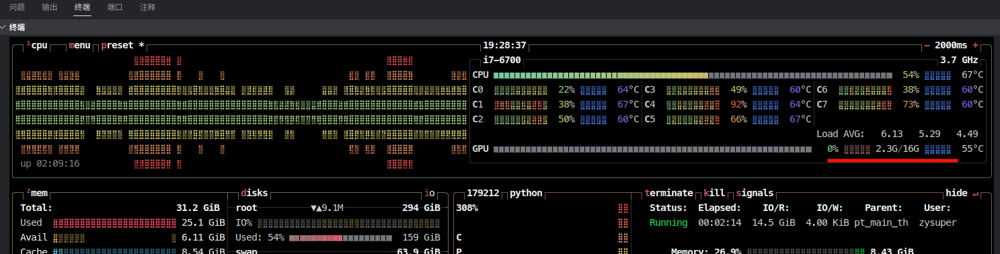
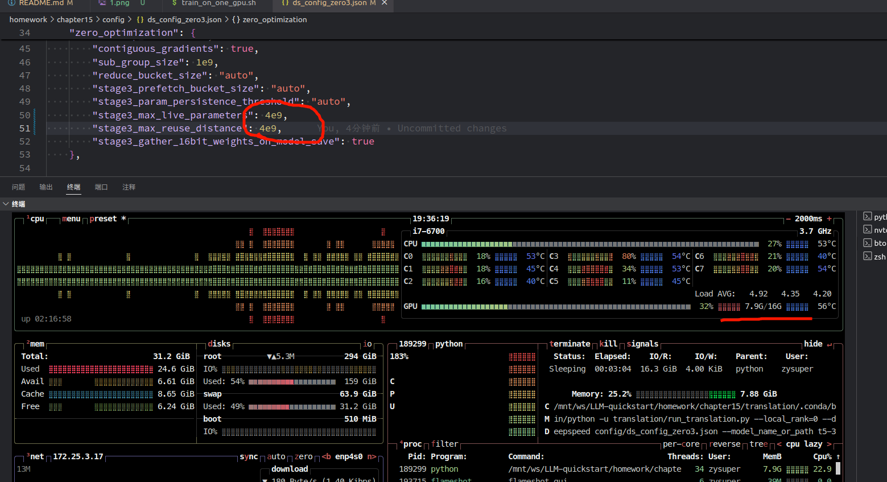
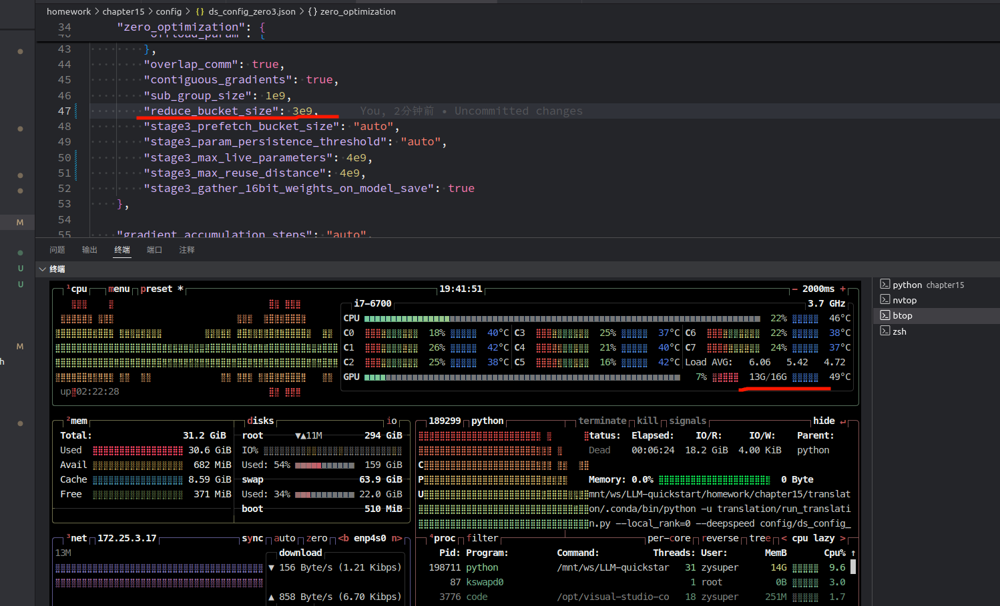

# 作业要求

调整 ZeRO-3 配置文件，使其支持 T5-3B 甚至 T5-11B 模型训练。

deepspeed --num_gpus=1 translation/run_translation.py \
--deepspeed config/ds_config_zero3.json --model_name_or_path t5-3b \
--do_train --do_eval --per_device_train_batch_size 1 --per_device_eval_batch_size 4 \
--output_dir output_dir --overwrite_output_dir --max_train_samples 500 --num_train_epochs 1 \
--dataset_name wmt16 --dataset_config "ro-en" --source_lang en --target_lang ro --fp16

1. 将 "offload_optimizer": "pin_memory" 设置为 **false**,可以改善 `optimizer state initialized` 完成的时间。当为 `true` 时，会在最后 93% 的时候卡成 ppt.
改过之后能继续了：
```
[2024-08-16 19:15:25,240] [INFO] [utils.py:782:see_memory_usage] MA 0.0 GB         Max_MA 0.0 GB         CA 0.06 GB         Max_CA 0 GB 
[2024-08-16 19:15:25,240] [INFO] [utils.py:789:see_memory_usage] CPU Virtual Memory:  used = 26.23 GB, percent = 83.8%
[2024-08-16 19:15:50,709] [INFO] [utils.py:781:see_memory_usage] After initializing optimizer states
[2024-08-16 19:15:50,727] [INFO] [utils.py:782:see_memory_usage] MA 0.0 GB         Max_MA 0.0 GB         CA 0.06 GB         Max_CA 0 GB 
[2024-08-16 19:15:50,728] [INFO] [utils.py:789:see_memory_usage] CPU Virtual Memory:  used = 28.95 GB, percent = 92.5%
[2024-08-16 19:15:50,773] [INFO] [stage3.py:485:_setup_for_real_optimizer] optimizer state initialized
```

1. 如果不增大 `stage3_max_live_parameters`，`stage3_max_reuse_distance`，会发现显存占用率很低。



将 `"stage3_max_live_parameters": 4e9,"stage3_max_reuse_distance": 4e9` 增大后，显存利用率上来了：



3. 还能可以手动设置 reduce_bucket_size 来继续增大显存是使用。



改了上述参数，能继续训练了，但是训练时间有点长。感觉并不是显存用的越多，训练越快。我机器的瓶颈好像在 cpu 上了。

# DeepSpeed 框架安装指南

## 更新 GCC 和 G++ 版本（如需）

首先，添加必要的 PPA 仓库，然后更新 `gcc` 和 `g++`：

```bash
sudo add-apt-repository ppa:ubuntu-toolchain-r/test
sudo apt update
sudo apt install gcc-7 g++-7
```

更新系统的默认 `gcc` 和 `g++` 指向：

```bash
sudo update-alternatives --install /usr/bin/gcc gcc /usr/bin/gcc-7 60 --slave /usr/bin/g++ g++ /usr/bin/g++-7
sudo update-alternatives --config gcc
```

## 创建隔离的 Anaconda 环境

如果想要隔离环境，建议采用 clone 方式，新建一个 DeepSpeed 专用的 Anaconda 环境：

```bash
conda create -n deepspeed --clone base
```

## 安装 Transformers 和 DeepSpeed

### 源代码安装 Transformers

遵循[官方文档](https://huggingface.co/docs/transformers/installation#install-from-source)，通过下面的命令安装 Transformers：

```bash
pip install git+https://github.com/huggingface/transformers
```

### 源代码安装 DeepSpeed

根据你的 GPU 实际情况设置参数 `TORCH_CUDA_ARCH_LIST`。如果你需要使用 CPU Offload 优化器参数，设置参数 `DS_BUILD_CPU_ADAM=1`；如果你需要使用 NVMe Offload，设置参数 `DS_BUILD_UTILS=1`：

```bash
git clone https://github.com/microsoft/DeepSpeed/
cd DeepSpeed
rm -rf build
TORCH_CUDA_ARCH_LIST="8.9" DS_BUILD_CPU_ADAM=1 DS_BUILD_UTILS=1 pip install . \
--global-option="build_ext" --global-option="-j8" --no-cache -v \
--disable-pip-version-check 2>&1 | tee build.log
```

**注意：不要在项目内 clone DeepSpeed 源代码安装，容易造成误提交。**

### 使用 DeepSpeed 训练 T5 系列模型

- 单机单卡训练脚本：[train_on_one_gpu.sh](train_on_one_gpu.sh)
- 分布式训练脚本：[train_on_multi_nodes.sh](train_on_multi_nodes.sh)